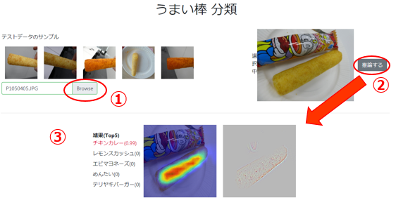
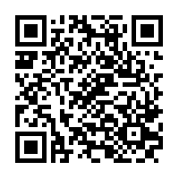

## うまい棒 分類のWebアプリ

### 使い方

分類させる画像は、①サンプルから選択するか、または端末のアルバムから選んで、②「推論する」ボタンを押すと、③結果が下部に出ます。

[デモ環境](http://umaibar.us-east-1.yasuda.ifdemo.ogis-lab.com/predict) 稼動時間 9:00-18:00

### 仕組み

フロントエンドはブラウザ上で動作するJavaScript、バックエンドはREST APIという構成をとっています。

以下はベースとしたフレームワーク等の簡単な説明

#### web

フロントエンドのWebアプリ

[Nuxt-bootstrap](https://bootstrap-vue.js.org/docs/) で作っています。

#### rest

Kerasで学習済みモデルを使って予測するREST API

このREST APIはPython flaskで作っています。

#### nginx

WebアプリのリクエストとREST APIのリクエストを振り分けます。

----

#### 注意

実行方法はそれぞれのプロジェクトに記載しています。

CPUの場合は基本的に1リクエストしか対応できません。
